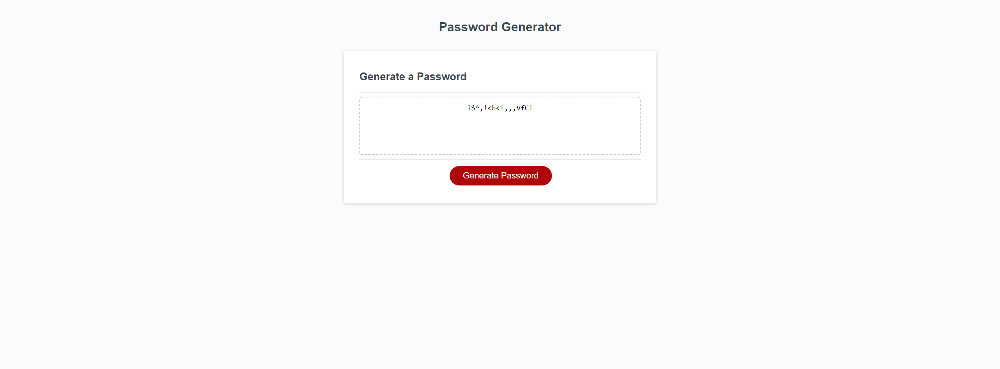

# Random Password generator

- This project is a simple password generator that will make a random password between 8 and 128 characters and may contain lowercase and uppercase characters, as well as numbers and special characters depending on the users preference.

## Table of Contents
- [General Info](#general-info)
- [Password Generator](#password-generator)
- [Technologies](#technologies)
- [Summary](#summary)
- [Author](#author)

## Genral Info

This is a simple password generator which meets the following criteria:

```
GIVEN I need a new, secure password
WHEN I click the button to generate a password
THEN I am presented with a series of prompts for password criteria
WHEN prompted for password criteria
THEN I select which criteria to include in the password
WHEN prompted for the length of the password
THEN I choose a length of at least 8 characters and no more than 128 characters
WHEN prompted for character types to include in the password
THEN I choose lowercase, uppercase, numeric, and/or special characters
WHEN I answer each prompt
THEN my input should be validated and at least one character type should be selected
WHEN all prompts are answered
THEN a password is generated that matches the selected criteria
WHEN the password is generated
THEN the password is either displayed in an alert or written to the page
```

## Password Generator



## Technologies

- [HTML](https://html.com/)
- [CSS](https://www.w3.org/Style/CSS/Overview.en.html)
- [Javascript](www.javascript.com)

## Summary

- This project is a simple password generator based on user preferences

## Author

- Joshua Azzam Rehanek